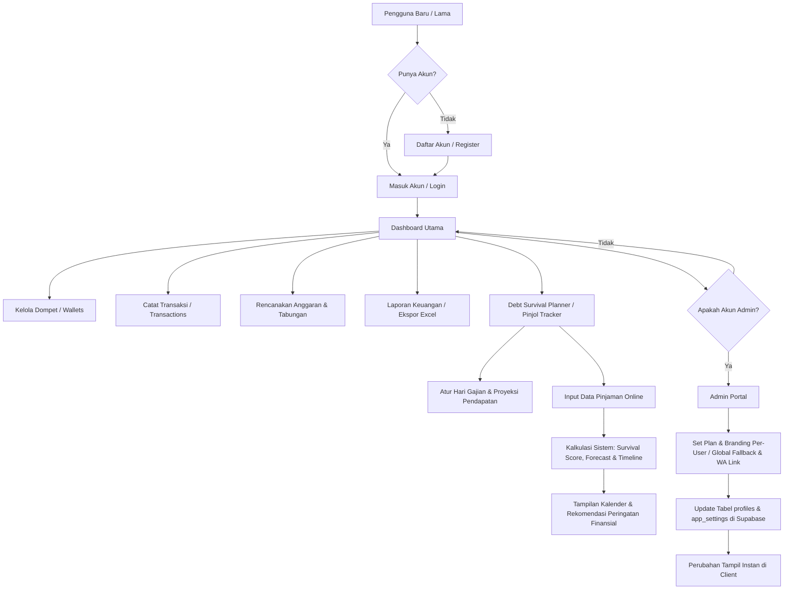

# 🪙 FinanceApp - Personal Finance & Debt Survival Planner

FinanceApp adalah platform manajemen keuangan pribadi modern berkinerja tinggi yang dirancang untuk membantu pengguna melacak, menganalisis, dan memproyeksikan arus kas secara real-time. Platform ini dilengkapi dengan modul unggulan **Debt Survival Planner** (Pinjol Tracker) untuk membantu pengguna keluar dari perangkap pinjaman online dengan analisis siklus gajian dan kalkulasi skor kelayakan hidup (*survival score*).

---

## 🌟 Fitur Utama

Berikut adalah modul-modul utama yang tersedia di FinanceApp:

| Modul | Deskripsi | Status |
| :--- | :--- | :--- |
| **📈 Dashboard Utama** | Ringkasan saldo bersih (*net worth*), grafik batang arus kas dinamis, saldo dompet aktif, dan log aktivitas transaksi terbaru. | Tersedia |
| **💳 Manajemen Dompet** | Mendukung banyak dompet sekaligus (Tunai, Bank BCA/Mandiri, E-Wallet GoPay/OVO) dengan penyesuaian saldo awal. | Tersedia |
| **💸 Transaksi Cepat** | Catat pengeluaran dan pemasukan berdasarkan kategori, dompet asal/tujuan, tanggal, serta catatan tambahan. | Tersedia |
| **🎯 Anggaran Bulanan** | Pembatasan anggaran per kategori pengeluaran dengan indikator *progress bar* real-time dan peringatan *overbudget*. | Tersedia |
| **🔒 Rencana Tabungan** | Target tabungan impian dengan tenggat waktu (*due date*), kalkulator persentase, dan log menabung yang aman. | Tersedia |
| **🤝 Utang & Piutang** | Pencatatan dana keluar/masuk dari kerabat atau pihak ketiga secara tradisional dengan pelacakan pelunasan. | Tersedia |
| **⚠️ Pinjol Tracker** | Modul khusus pendeteksi beban pinjaman online dengan visualisasi kalender jatuh tempo terhadap hari gajian. | Unggulan |
| **📊 Laporan & Ekspor** | Visualisasi diagram lingkaran (*pie chart*) pengeluaran bulanan dan tombol **Ekspor ke Excel (.xlsx)** instan. | Tersedia |
| **🛡️ Admin Portal** | Panel pengaturan plan (Free/Pro), kustomisasi branding (nama app, logo) per-user untuk Pro Plan, serta setting WhatsApp admin dan fallback branding global. | Khusus Admin |

---

## ⭐ Debt Survival Planner (Fitur Unggulan)

Modul ini dirancang khusus untuk menghadapi tantangan finansial dari pinjaman online (Pinjol):

*   **Siklus Hari Gajian (*Salary Cycle*):** Atur tanggal gajian rutin Anda untuk membagi rentang waktu pembayaran yang rasional.
*   **Proyeksi Pemasukan (*Income Projections*):** Daftarkan proyeksi nominal gaji pokok atau pemasukan sampingan per periode gaji.
*   **Proyeksi Arus Kas 12 Periode:** Menampilkan simulasi saldo sisa uang kas setelah dikurangi total cicilan jatuh tempo selama 12 periode gaji ke depan.
*   **Visualisasi Kalender:** Penempatan tanggal jatuh tempo cicilan relatif terhadap tanggal gajian untuk mempermudah identifikasi penumpukan tanggal bayar (*due-date clustering*).

> [!TIP]
> **Mengapa siklus gaji itu penting?** 
> Sebagian besar kegagalan bayar pinjol terjadi karena ketidakcocokan antara tanggal jatuh tempo pinjaman dengan tanggal penerimaan gaji utama. Modul ini menyelaraskan kedua parameter tersebut secara otomatis.

---

## 📊 Alur Kerja Aplikasi (App Flow)

Bagan berikut menjelaskan bagaimana data diproses di dalam platform FinanceApp:



---

## 🧮 Formula Perhitungan Debt Survival Score

Sistem menggunakan algoritma skor kelayakan hidup finansial (*Survival Score*) dengan skala **0 - 100** yang dihitung dari 5 parameter utama berikut:

### 1. Rasio Utang terhadap Pendapatan (*Debt-to-Income Ratio*)
Dihitung berdasarkan persentase cicilan bulanan dari total pemasukan:
$$\text{Debt Ratio} = \left( \frac{\text{Total Cicilan Pinjol Bulanan}}{\text{Total Proyeksi Pendapatan Bulanan}} \right) \times 100$$

*   **Rasio < 10%:** Sangat Aman (Skor Optimal)
*   **Rasio 10% - 30%:** Waspada / Manageable
*   **Rasio 30% - 50%:** Berat (Pengurangan skor signifikan)
*   **Rasio > 50%:** Bahaya (Skor berkurang drastis)

### 2. Likuiditas Kas Sisa (*Remaining Cash*)
Jika sisa uang kas setelah dipotong cicilan berada di bawah batas aman minimum (**Rp 500.000**), sistem mengenakan penalti likuiditas berat karena risiko kegagalan membayar kebutuhan pokok harian.

### 3. Jumlah Pinjol Aktif (*Active Debt Count*)
Memiliki banyak aplikasi pinjol aktif menurunkan fokus manajemen keuangan:
*   Jika jumlah pinjaman aktif **$\ge$ 3**, skor dikurangi **15 poin** secara otomatis karena tingginya bunga akumulatif dan biaya administrasi tersembunyi.

### 4. Penumpukan Tanggal Jatuh Tempo (*Clustered Due Dates*)
*   Jika terdeteksi ada lebih dari 2 pinjaman dengan rentang tanggal jatuh tempo kurang dari **3 hari**, sistem mendeteksi risiko penumpukan tanggal bayar (*default risk*) dan mengurangi skor sebesar **10 poin**.

### 5. Risiko Defisit Mendatang (*Future Deficit Period*)
*   Jika ada satu saja periode dalam 12 bulan ke depan yang diproyeksikan memiliki sisa saldo minus (pengeluaran cicilan > pendapatan), skor survival global secara otomatis dikunci maksimal pada nilai **30 (Danger Zone)**.

---

## ⚙️ Petunjuk Instalasi & Pengembangan Lokal

### Prasyarat System
*   **Node.js** versi 18 atau lebih baru.
*   **Supabase Project** (Database & Autentikasi).

### Langkah 1: Kloning & Instal Dependensi
```bash
# Klon repositori proyek
git clone <repository-url>
cd FinanceApp

# Instal paket modul Node.js
npm install
```

### Langkah 2: Konfigurasi Environment Variables
Buat file bernama `.env.local` pada direktori root proyek Anda dan sesuaikan dengan kredensial Supabase Anda:
```env
NEXT_PUBLIC_SUPABASE_URL=https://your-project-ref.supabase.co
NEXT_PUBLIC_SUPABASE_ANON_KEY=your-supabase-anon-key
```

### Langkah 3: Eksekusi Migrasi Database (Supabase SQL)
Buka SQL Editor di dasbor proyek Supabase Anda, jalankan skrip SQL di folder `supabase/migrations/` secara berurutan sesuai nomor filenya:
1.  `001_initial_schema.sql` (Skema Tabel Utama, Dompet, Transaksi, Anggaran, Tabungan, Utang, Pelacak Pinjol, Proyeksi Gaji, dan Pengaturan Branding Global)
2.  `002_user_plan_and_branding.sql` (Skema kolom Plan user, Branding per-user, dan Link Kontak WhatsApp Admin di tabel profiles)
3.  `003_fix_profile_trigger.sql` (Perbaikan trigger otomatis saat registrasi user baru)
4.  `004_fix_missing_columns.sql` (Penyesuaian kolom is_suspended pada profil)
5.  `005_profiles_read_policy.sql` (Perbaikan kebijakan akses/RLS SELECT tabel profiles)

### Langkah 4: Registrasi Akun SuperAdmin
Untuk menguji panel Admin Portal, jalankan skrip pembuatan superadmin. Anda dapat mengubah detail email/password di dalam file `create-superadmin.js` terlebih dahulu sebelum dieksekusi:
```bash
node create-superadmin.js
```

### Langkah 5: Menjalankan Server Lokal
```bash
npm run dev
```
Buka browser Anda dan navigasikan ke alamat [http://localhost:3000](http://localhost:3000).

---

## 📌 Alur Panduan Pengguna Baru (*First-time User*)

1.  **Daftar Akun Baru:** Masuk ke halaman `/register` untuk membuat akun Anda.
2.  **Buat Dompet Pertama:** Buka menu **Dompet** (Wallets), buat dompet baru, misalnya "Rekening Utama" dengan saldo Rp 5.000.000.
3.  **Catat Transaksi Belanja:** Coba masukkan pengeluaran di menu **Transaksi**, pilih dompet "Rekening Utama" sebagai sumber dana. Saldo dompet akan berkurang secara real-time.
4.  **Siapkan Pinjol Tracker:**
    *   Buka halaman **Pinjol Tracker** (Debt Survival Planner).
    *   Tentukan tanggal gajian tetap Anda (misalnya tanggal 25) pada panel proyeksi pendapatan, serta masukkan estimasi gaji bersih Anda.
    *   Tambahkan data pinjaman baru (jumlah terima, nominal pengembalian, tenor bulan, tanggal mulai, dan tanggal jatuh tempo bulanan).
    *   Perhatikan hasil kalkulasi *Survival Score*, grafik forecast 12 periode, serta pemetaan jatuh tempo di dalam tab *Timeline JT* dan *Kalender*.
5.  **Unduh Laporan Bulanan:** Masuk ke halaman **Laporan** untuk melihat diagram ringkasan dan klik tombol **Ekspor ke Excel** untuk mengunduh arsip transaksi.

> [!IMPORTANT]
> Fitur **Admin Portal** hanya akan muncul di bilah navigasi kiri/bawah apabila Anda masuk menggunakan akun yang memiliki metadata `is_admin = true` (dibuat menggunakan skrip `create-superadmin.js`).
